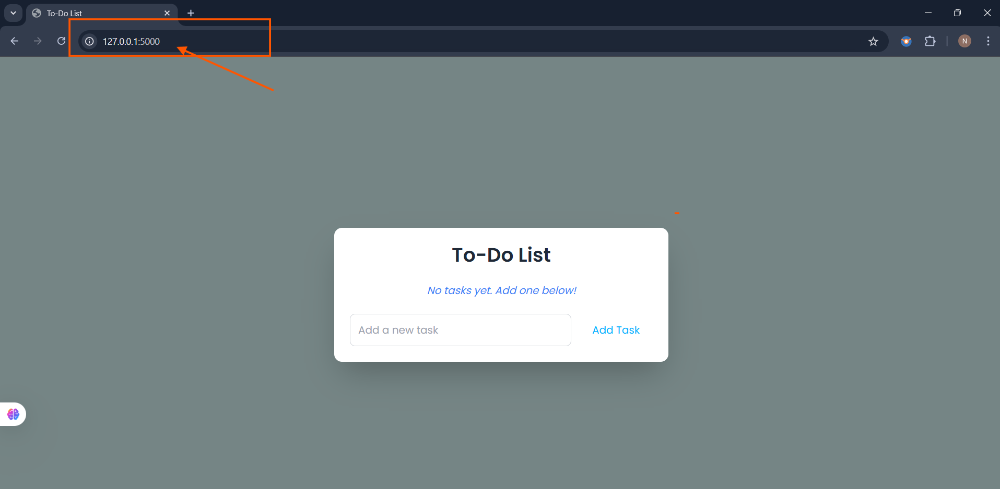

1. Created app.py, templates/index.html , templates/edit.html, static/css/styles.css
2. In terminal, run `pip install -r requirements.txt`
3. create `.gitignore` file
4. Now run `python3 app.py` in the terminal
5. Now we have our app 

It is running locally, But what if we wanted to make it available to others. Let's push the code into the server and deploy there.
6. We will do it but before that i wanted to move this code to the github to have versioning of the code for our app
7. So, now it's time to push our code to the github repository
check status by using `git status` and then do the gitworkflow
i.e; `git init, git add ., git push`
8. Now, let's spinup the server in the cloud let's say in our case it is AWS (Ec2 instance)
9. Now, we have created ec2 instance in the cloud and connected to it and created one directory for our app let's say `cloud-native-to-do-app`. Let's get into it by using `cd cloud-native-to-do-app` and now clone the repo using `git clone https://github.com/charan-happy/Cloud-Native-To-Do-App.git`
10. Just to make sure it is running, enter the commands that we run in our laptop. after running `python3 app.py` try to enter your serversip:5000 . Note : you should enable 5000 inbound port in security groups while initialising the server in the cloud.
11. Till now we are happy . But we want this app should be up and running. which will consume a lot of resources and cost involved. To overcome this we have something called as docker to containerise our application.
12. Let's do the containerisation. For that we need to have `Dockerfile` once we have it we need to build image with the dockerfile by using `docker build -t <name> .` once we build the image, we need to run image which leads to the creation of container. use `docker run -it -d <name> -p <hostport>:<containerport>
13. Now try to access the app at `localhost:5000`
14. Till now everything is fine. Now let's setup CICD pipeline (we have already did some cd steps😂)
15. Create one 